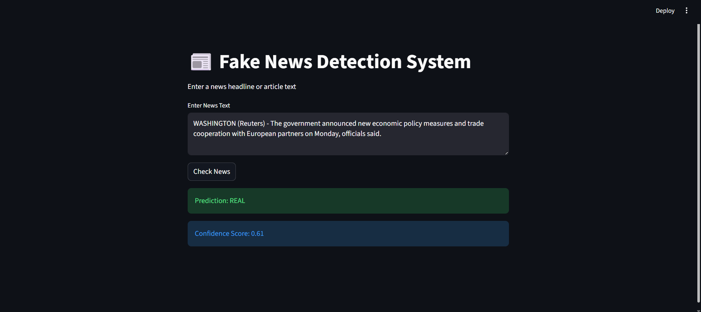

# Fake News Detection Using Social Media Data (Clean Architecture)

## 📌 Project Overview

Fake news on social media platforms spreads rapidly and can influence public opinion, create panic, and cause social harm. This project focuses on detecting fake news using machine learning and natural language processing (NLP) techniques applied to social media text data.

The system analyzes news content (such as headlines or posts) and predicts whether the information is **real** or **fake**. The project is structured using **Clean Architecture principles**, making it modular, maintainable, and easy to extend.

---

## 🎯 Objectives

* Detect fake news from social media text data
* Apply NLP techniques for text preprocessing
* Use a trained machine learning / deep learning model for classification
* Design the project using clean, scalable architecture
* Provide an easy-to-run prediction pipeline

---

## 🏗️ Project Architecture (Clean Architecture)

```
fake-news-detection-clean-architecture/
│── app.py                  # Main application entry point
│── predict.py              # Prediction logic
│── test_import.py          # Import and environment test
│── requirements.txt        # Project dependencies
│── README.md               # Project documentation
│── .gitignore              # Ignored files and folders
│
│── fake_news_model/
│   │── __init__.py
│   │── preprocessing.py    # Text cleaning & preprocessing
│   │── tokenizer.py        # Tokenization utilities
│   │── model_loader.py     # Model loading logic
│   │── README.md           # Model usage instructions
```

**Architecture layers:**

* **Presentation Layer**: app.py (user interaction)
* **Application Layer**: predict.py (use cases)
* **Domain Layer**: core fake news detection logic
* **Infrastructure Layer**: model loading, preprocessing utilities

---

## 🧠 Technologies Used

* Python 3
* Natural Language Processing (NLP)
* Machine Learning / Deep Learning
* Hugging Face / Transformers (optional)
* Git & GitHub

---

## 📊 Dataset

The dataset consists of labeled news or social media text data classified as:

* **Real News**
* **Fake News**

Common sources:

* Kaggle fake news datasets
* Publicly available social media datasets

*(Dataset is not included in this repository)*

---

## 🤖 Model Information

Due to GitHub file size limitations, the trained model file (`model.safetensors`) is **not stored directly in this repository**.

### 🔽 How to get the model

* Download the trained model from an external source (Google Drive / Hugging Face)
* Place the file inside:

```
fake_news_model/model.safetensors
```

This approach follows **industry best practices** for machine learning projects.

---

## ⚙️ Installation & Setup

### 1️⃣ Clone the repository

```bash
git clone https://github.com/diilshhad/fake-news-detection-clean-architecture.git
cd fake-news-detection-clean-architecture
```

### 2️⃣ Create virtual environment (optional but recommended)

```bash
python -m venv venv
venv\Scripts\activate   # Windows
```

### 3️⃣ Install dependencies

```bash
pip install -r requirements.txt
```

---

## ▶️ How to Run the Project

### Run the application

```bash
python app.py
```

### Run prediction directly

```bash
python predict.py
```

---

## 🧪 Testing

To verify imports and environment:

```bash
python test_import.py
```

---

## ✅ Features

* Text preprocessing and cleaning
* Tokenization and feature extraction
* Fake vs Real news classification
* Modular and scalable clean architecture
* Easy integration with new datasets or models

---

## 🖥️ Streamlit Results Preview

Below are sample outputs from the Streamlit application showing **Fake** and **Real** news prediction results.

### 🔴 Fake News Prediction


### 🟢 Real News Prediction



---

## 🚀 Future Enhancements

* Add web interface (Flask / FastAPI)
* Real-time social media data streaming
* Model retraining pipeline
* Multi-language fake news detection

---

## 🎓 Academic & Coursera Submission Note

This project is designed to meet **academic integrity and submission standards of TCS**:

* Original implementation
* Clean project structure
* Clear documentation
* No large binary files committed

---

## 👤 Author

**Dilshad Muhammed**

---

## 📜 License

This project is intended for **educational purposes only**.

---

⭐ If you find this project useful, feel free to star the repository!

